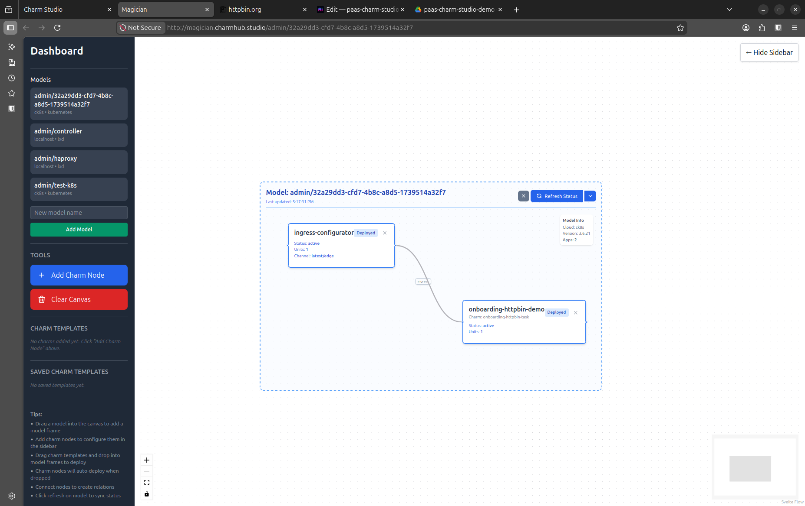

# Juju Magician - Infrastructure Management GUI

A modern web application for visualizing and managing Juju infrastructure. Built with Svelte 5 and Flask, packaged as a single classic snap.

## Screenshots


## Project Structure

```
magician/
├── backend/
│   ├── app.py                 # Flask API server
│   └── requirements.txt       # Python dependencies
├── frontend/
│   ├── src/
│   │   ├── lib/
│   │   │   ├── nodes/
│   │   │   │   ├── CharmNode.svelte    # Custom charm node component
│   │   │   │   └── ModelFrame.svelte   # Group node for Juju models
│   │   │   ├── edges/
│   │   │   │   └── RelationEdge.svelte # Custom relation edge component
│   │   │   └── api.js                   # API utility functions
│   │   ├── App.svelte                   # Main application
│   │   ├── main.js                      # Entry point
│   │   └── app.css                      # Global styles
│   ├── index.html
│   ├── package.json
│   └── vite.config.js
├── snap/
│   ├── snapcraft.yaml          # Snap packaging definition
│   └── local/
│       ├── start-backend.sh    # Backend service launcher
│       └── start-frontend.sh   # Frontend service launcher
└── README.md
```

## Features

### Backend (Flask)
- Async execution using ThreadPoolExecutor
- RESTful API wrapping the Juju CLI via [jubilant](https://github.com/juju/jubilant)
- CORS enabled for frontend integration
- Background task tracking

### Frontend (Svelte 5)
- Drag-and-drop canvas using Svelte Flow
- Custom CharmNode, RelationEdge, and ModelFrame components
- Real-time status updates
- Trust configuration management
- Config reset/empty choice prompt
- Modern UI with TailwindCSS and Svelte 5 Runes

## Deployment

Magician is distributed as a **single classic snap** containing both the backend and frontend as daemon services.

### Prerequisites

- Ubuntu host with `snapd`
- `juju` snap installed and a controller bootstrapped
- `snapcraft` and `lxd` snaps (for building)

### Building the Snap

```bash
snapcraft pack
```

This runs inside a LXD container (core24 base). The output is `magician_0.1.0_amd64.snap`.

### Installing

```bash
sudo snap install magician_0.1.0_amd64.snap --dangerous --classic
```

Both services start automatically as daemons:

| Service | Port | Description |
|---|---|---|
| `magician.backend` | 5000 | Flask API (runs as `ubuntu` user) |
| `magician.frontend` | 8080 | Vite preview server |

### Managing Services

```bash
# Check status
snap services magician

# Restart
sudo snap restart magician.backend
sudo snap restart magician.frontend

# View logs
sudo snap logs magician.backend -n 50
sudo snap logs magician.frontend -n 50
```

## Development

For local development without snap packaging:

### Backend

```bash
cd backend
python3 -m venv venv
source venv/bin/activate
pip install -r requirements.txt
flask --app app run --host 0.0.0.0 --port 5000
```

### Frontend

```bash
cd frontend
npm install
npm run dev
```

The dev server runs on `http://localhost:5173` and proxies `/api` requests to the backend.

## Usage

1. **Add Charm Nodes** — Click "Add Charm Node" in the sidebar, fill in charm details, and deploy
2. **Create Relations** — Drag between node handles, configure endpoints, and connect
3. **Manage Models** — Each Model Frame represents a Juju model; click refresh to sync state
4. **Canvas Controls** — Pan (drag background), zoom (scroll wheel), minimap (bottom-right)

## API Endpoints

| Method | Path | Description |
|---|---|---|
| `GET` | `/api/models` | List Juju models |
| `GET` | `/api/status/<model>` | Get model status |
| `POST` | `/api/deploy` | Deploy a charm |
| `POST` | `/api/relate` | Create a relation |
| `GET` | `/api/task/<task_id>` | Poll background task status |
| `GET` | `/api/config/<model>/<app>` | Get application config |
| `POST` | `/api/config/<model>/<app>` | Update application config |
| `GET` | `/api/config/<model>/<app>/trust` | Get trust setting |
| `POST` | `/api/config/<model>/<app>/trust` | Update trust setting |
| `POST` | `/api/config/<model>/<app>/reset` | Reset config keys to default |

## Technologies

- **Svelte 5** (Runes), **@xyflow/svelte**, **TailwindCSS**, **Vite**
- **Flask**, **flask-cors**, **jubilant**
- **Snapcraft** (core24, classic confinement)

## Troubleshooting

- **Backend can't find `juju`** — Ensure the `juju` snap is installed: `sudo snap install juju --channel=3/stable`
- **"No controllers registered"** — Bootstrap a controller: `juju bootstrap`
- **Frontend 404** — Check that Vite config was copied to writable storage; restart `magician.frontend`
- **Snap build fails on newer Ubuntu** — Snapcraft uses LXD to build in a core24 container; ensure `lxd` is installed

## License

MIT
